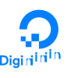

# Hi there, I'm Dhruvin Dave 👋

Welcome to my GitHub profile! I'm a passionate developer with a knack for problem-solving and a love for continuous learning. Here's a bit about me:

## 🚀 About Me

- 🔭 Currently working on innovative projects using **NodeJS/Express**, **PHP Laravel** and **AWS**.
- 🌱 Continuously learning and staying up-to-date with the latest tech trends.
- 👯 Looking to collaborate on open-source projects and groundbreaking ideas.
- 💬 Ask me about web development, cloud solutions, or any tech-related topics.
- 📫 Reach me at:  

---

## 💼 Skills

### Technical Skills

#### Languages & Frameworks

  
  
  
  

#### Cloud & DevOps

  
  
  &nbsp;
  

#### Databases

  
  
  
  

#### Others

  
  

### Soft Skills

- **Communication:**
  - 💬 Strong conversational skills, adept at handling clients and understanding their requirements.
  - 📝 Excellent written and verbal communication, ensuring clear and concise information sharing.
- **Problem Solving:**
  - 🔍 Analytical thinker with a structured approach to solving complex problems.
  - 💡 Proactive in identifying potential issues and implementing effective solutions.
- **Team Collaboration:**
  - 🤝 Experience working in agile teams, promoting collaboration and teamwork.
  - ⚡ Ability to work well under pressure and adapt to changing environments.

---

## 🏆 Achievements

- **Deployed Production-Level Clusters**: Successfully deployed MySQL, MongoDB, and EMQX clusters using Docker, ensuring robust and scalable production environments.
- **Proficient in CI/CD**: Gained hands-on experience with GitHub Actions for continuous integration and continuous deployment (CI/CD), streamlining development workflows.
- **Full-Stack Expertise**: Extensive experience with both PHP and Node.js, building and maintaining dynamic web applications.
- **Problem-Solving Skills**: Demonstrated a strong ability to analyze and solve complex problems efficiently.
- **Database Management**: Specialized in database management with comprehensive experience in MySQL and MongoDB, managing vast datasets and optimizing performance.

---

## 📈 GitHub Stats

  
  

  

#### Profile views counter

---

*Thank you for visiting my GitHub profile! Feel free to explore my repositories and reach out if you have any questions or collaboration ideas.*
